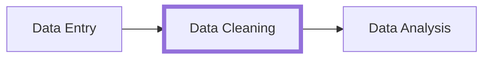

# Collaborative Document

2022-05-30 Data Carpentry with Python (day 1)

Welcome to The Workshop Collaborative Document.

This Document is synchronized as you type, so that everyone viewing this page sees the same text. This allows you to collaborate seamlessly on documents.

## 👮Code of Conduct

Participants are expected to follow these guidelines:
* Use welcoming and inclusive language.
* Be respectful of different viewpoints and experiences.
* Gracefully accept constructive criticism.
* Focus on what is best for the community.
* Show courtesy and respect towards other community members.

## ⚖️ License

All content is publicly available under the Creative Commons Attribution License: [creativecommons.org/licenses/by/4.0/](https://creativecommons.org/licenses/by/4.0/).

## 🙋Getting help

To ask a question, type `/hand` in the chat window.

To get help, type `/help` in the chat window.

You can ask questions in the document or chat window and helpers will try to help you.

## 🖥 Workshop information

:computer:[Workshop website](https://esciencecenter-digital-skills.github.io/2022-05-30-dc-socsci-python-nlesc/)

🛠 [Setup](https://esciencecenter-digital-skills.github.io/2022-05-30-dc-socsci-python-nlesc/#setup)

:arrow_down: Download the following files and place them in a single, easily findable folder:
- [SAFI_clean.csv](https://ndownloader.figshare.com/files/11492171)
- [SAFI_messy.xlsx](https://ndownloader.figshare.com/files/11502824)
- [SAFI_dates.xlsx](https://ndownloader.figshare.com/files/11502827)
- [SAFI_openrefine.csv](https://ndownloader.figshare.com/files/11502815)


## 🗓️ Agenda
| Time  | Topic                             |
|------:|:----------------------------------|
| 9:00  | Welcome & introduction            |
| 9:30  | Data Organization in Spreadsheets |
| 10:45 | Coffee break                      |
| 11:00 | OpenRefine for Data Cleaning      |
| 12:00 | Coffee break                      |
| 12:15	| Introduction to Python            |
| 12:45 | Day 1 wrap-up                     |
| 13:00 | END                               |


## 🔧 Exercises

### Messy data exercise
We’re going to take a messy version of the SAFI data and describe how we would clean it up.

Download the [messy data](https://ndownloader.figshare.com/files/11502824).

1. Open up the data in a spreadsheet program.
2. Notice that there are two tabs. Two researchers conducted the interviews, one in Mozambique and the other in Tanzania. They both structured their data tables in a different way. Now, you’re the person in charge of this project and you want to be able to start analyzing the data.
3. In your breakout room, identify what is wrong with this spreadsheet. Discuss thesteps you would need to take to clean up the two tabs, and to put them all together in one spreadsheet. Write this down in a list in the collaborative document.
4. **Important** You don't have to clean the data, just write down the possible improvements.

After you go through this exercise, we will discuss as a group what was wrong with this data and how you would fix it.

### Exercise: Faceting

1. Using faceting, find out how many different `interview_date` values there are in the survey results.
2. Is the column formatted as Text or Date?
3. Use faceting to produce a timeline display for `interview_date`. You will need to use `Edit cells` > `Common transforms` > `To date` to convert this column to dates.
4. During what period were most of the interviews collected?

### Exercise: Transforming Data
Perform the same clean up steps and customized text faceting for the `months_lack_food` column. **Which month were farmers more likely to lack food?**


## 🧠 Collaborative Notes

#### eScience Center and Workshop Welcome
(Lieke):
Website shared. Center tries to work with researchers and has open calls. Link provided in chat. We also sponsor NL-RSE, whcih organizes meet-ups to discuss topics in research software engineering.
(Barbara):
We will use open tools to help with automation and reproducibility over the next four days. Today a bit of data and how to clean it up using open-refine. The next three days will focus on Python. We are using
a hack-md document. (Explanation of how to use the collaborative document. Roll call.)
Agenda. Ice-breaker.


#### Spreadsheets.

Crowd/participant survey on whether you want more Python (not spreadsheets), if you used spreadsheets, if you ever got frustrated with spreadsheets...we will review one or two tricks in Excel, but mostly we will tell you not to use Excel. We will cover how we go from spreadsheets to something a computer can work with. The pipeline we will show uses spreadsheets, but as a tool for entering data. We will even take cleaning steps away from spreadsheet, and final steps will be in Python.

What is data that can be used well by a computer? Tidy Data : each variable forms its own column, each observation has its own row and each observation has its own cell. There are many ways to diverge from this, but that makes it harder for a computer to work with. "Every tidy datasets is alike but every messy dataset is messy in its own way". A tidy dataset streamlines process of further downstream analysis. We will work with the SAFI dataset. It includes interviews, data on households, agricultural practices, etc. We will start by looking at this dataset together. In breakout rooms, we will start looking at the data and discuss, write steps in collaborative documents to put together two tabs of data. Discussion on steps by groups for solution to this particular 'messy data'. Important notes from the discussion:

    -There are various ways of indicating missing data, but being consistent in a merged set is important.

    -There are some problems that can be fixed with a code-book. Codebooks can be an important tool to make data re-usable.

    - We must encode data in text or some other way the computer code we later make will 'understand' (not color or some other way which may be easy for us to see, but not the computer)

    -Perhaps use a notes column for further data

    -Naming of key ideas has specific considerations. Consider making it an 'obscure' string to avoid accidental analysis of it

    -Questions on how to take the spreadsheet with you as you go to interviews or other data collection. Advise to keep it 'clean' but it doesn't have to be tidy. Steps between a clean datatset and tidy dataset can be automated.

    -Importance of metadata. Metadata is often formatted in a specific way (vital for re-usability)

    -Spell check


Further notes: When you start processing you data, do not touch raw data! You will need it for many reasons. Keep it stored away, read only. We want you to see this tool as a data entry tool, not a tool for analysis. You can do a quick and dirty plot, but we hope you will do these steps with other tools e.g. Python. Other tools allow you to standardize, automate, and replicate. You can retrieve your steps in a script. Dates are worthy of special attention. Example: 7th of March may read incorrectly as 3rd of July based on how Excel is formatting it. Remember files may be loaded in a different program. Consider different ways to store dates e.g. day , month and years separate. Another important issue is measurements. Watch out for units. Units should be in a codebook, a header or both. Don't put the unit in the cell (then you can't do operation on it). Formatting best practices covered in links/resources. Finally, save data in an open format. Open file formats are .csv or even a .tsv. The advantage is both are open, so you won't need licenses to open the files. Another advantage is that they are text based , as opposed to Excel files which can not be opened and read in a text reader.

Questions on different types of csvs. Issues when commas are used as separator. There are ways around the problem e.g. using a different separator (perhaps a very obscure character).Open office may give a bit more control on storage of csvs.

Take home points:

Use spreadsheets to only enter data

Openrefine to clean

Use tools like python

Do not touch your raw data


### Open Refine

Data pipeline:



Data cleaning with **OpenRefine**:

* Open source ([source on GitHub](https://github.com/OpenRefine/OpenRefine)).
* A large growing community, from novice to expert, ready to help.
* Works with large-ish datasets (100,000 rows).
* OpenRefine always keeps your data private on your own computer.


(Francesco) OpenRefine:
We are looking at data cleaning. What can we do with OpenRefine? Find errors, make data consistent. There are many tools to do this. OpenRefine is free and opensource, and has a growing community (you can google and talk with others on issues). OpenRefine keeps your data private. It does not require internet connection (but you use a browser). Follow-along hands on for demonstration. Note OpenRefine should work on all systems, Mac included. Any browser should be fine, perhaps on a Mac, Safari is better.

We open data with OpenRefine. If you realize file is encoded in another way, you may modify. One useful feature of OpenRefine is facets. Facets are way to group values in columns.We can get an overview of the values in a dataset this way (by looking at facets).
We will look at automatic ways to identify errors.
Exercise with SAFI_openrefine.csv file (if you have not downloaded also available in chat).
    -Timeline facet for dates- produces something nonsensical seeming. Very likely imported as text. Need to use edit cells, common transform, to date, and convert column in this case. Then OpenRefine will understand these as dates, and they can be made into a histogram, and manipulated correctly.
    -Close facets with top left click
    -Clustering: we here will cluster values on the basis of some phonetic features. OpenRefine suggests some values for us, but we don't have to follow. There are different ways to cluster. Check other clustering methods
    -Can we define our own clustering methods? Probably not (yet) implemented.

We can edit our steps. Be careful in going back.

    Undo/redo tab

Columns can be complex for various reasons. We may need to get rid of special charecters, and do other steps.

To get rid of special charecters: edit cells, transform (follow pop-up windows). We can type expressions in multiple languages including Python. But we can also use OpenRefine language (there is lots of documentation for this). Example of removing opening square bracket. We can copy-paste to speed this up.
Question on undoing one specific step in the middle of a sequence is awnsered with the idea that you can't do it that way. You could undo step by step.
There are tools and methods to seperate out certain values in columns.
Way to see all the column names: all, dropdown, edit columns, reorder.
Contiued exercise, special type of faceting: custom-text

#### Separate items in the `items_owned` column
Click on the arrow next to 'items_owned'
In the 'expression' box, type: `value.split(";")`

#### Filtering & sorting
Filtering: Select a column (e.g. 'Village') > text filter > type in the box (left part of screen) to filter the data
Sorting: Select column, e.g. 'gps_Longitude' > Sort > Use the dialog to sort, even if there is text, you can still sort by number

#### Exercise solution
1. Get rid of special characters in `months_lack_food`:
    -. Click on edit cells > transform, use expression: `value.replace("[","").replace("]","").replace("'","").replace(" ","")` (check 'History' to reuse expressions!)
2. Look at the different months and see the frequency:
    custom text > facet, use expression `value.split(";")`
3. Sort by 'count'

#### How to export the operations?
This way, others can apply the same changes to their raw dataset.
1. Undo/Redo tab >
2. extract >
3. tick boxes of steps to export

This code is in .json format, and you can copy it and paste it into an empty (plain text) document.

Apply someone else's code:
1. Open the same file as they have
2. Open the Undo/redo tab
3. Click 'apply'
4. Paste the steps (same .json format)
5. Click 'perform operation'

OpenRefine stores your project history; when opening OpenRefine you can find projects in progress under 'Open Projects'.

Another option is to export the history and the data both:
Export > Open refine project character file
This generates a compressed archive that includes the entire project, data and cleaning steps included.

#### How to export the clean data?
Export > Tab-separated value (.tsv) or Comma-separated value (.csv)
This exports the data into a .tsv or .csv file that can be used for further analysis.

### Python
Mac/Linux: open terminal, enter:
```
jupyter lab
```

Windows: start 'anaconda navigator', choose 'Jupyter Lab'
OR: open anaconda prompt, and type
```
jupyter lab
```

From jupyter lab: click 'Notebook' > 'Python 3'
Rename the file by right-clicking on the notebook (on the left side), click 'rename'.
`01_introduction_python.ipynb`

Type in the cell:
```python=
a = 2
b = 3
a*b
```
Click 'play' (the triangle icon) to run the cell.


## 📚 Resources
[Good Enough Practices for Scientific Computing](https://journals.plos.org/ploscompbiol/article?id=10.1371/journal.pcbi.1005510)

[Karl W. Broman & Kara H. Woo, Data Organization in Spreadsheets](https://www.tandfonline.com/doi/full/10.1080/00031305.2017.1375989)

[Hadley Wickham, Tidy Data](http://www.jstatsoft.org/v59/i10)
